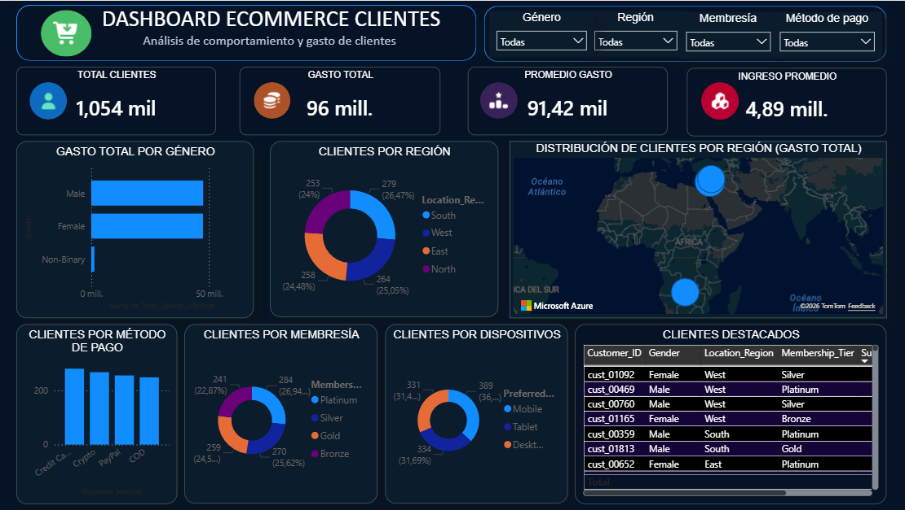

# Dashboard Ecommerce Clientes

## Objetivo
Análisis del comportamiento y gasto de clientes en ecommerce utilizando Power BI.

## Herramientas utilizadas
- Power BI
- DAX
- Modelado de datos
- Visualización de datos

## KPIs analizados
- Total clientes
- Gasto total
- Promedio de gasto
- Ingreso promedio

## Características
- Segmentación por género
- Segmentación por región
- Análisis de membresías
- Distribución geográfica
- Métodos de pago
- Dispositivos utilizados

## Vista previa

## Archivo del proyecto
ecommerce_sunny.pbix
